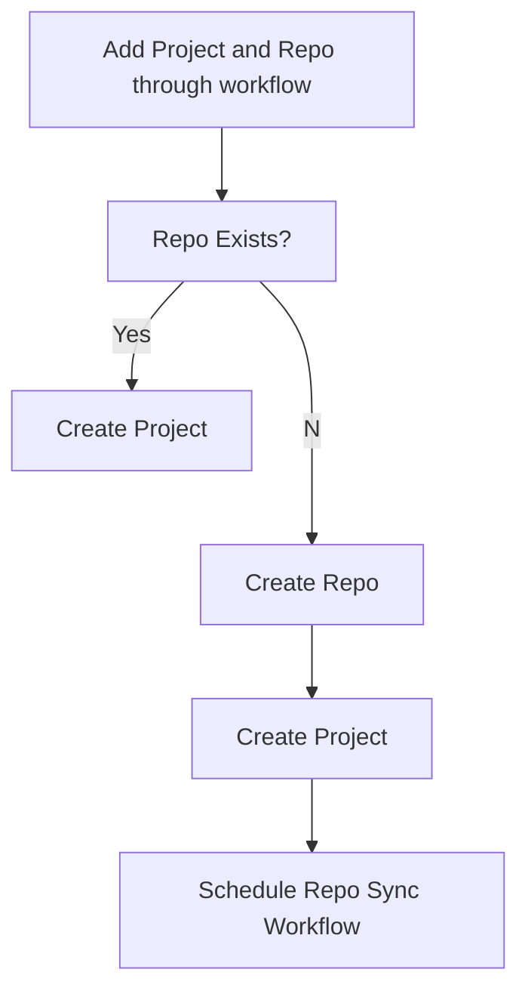
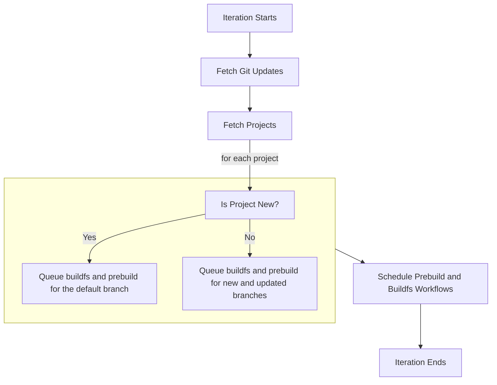

# What happens when a project is added

```mermaid
graph TD;
  AddProject[Add Project and Repo through workflow]-->RepoExists[Repo Exists?];
  RepoExists--Yes-->CreateProjectRepoExists[Create Project];
  RepoExists--No-->CreateRepo[Create Repo];
  CreateRepo-->CreateProjectRepoNotExists[Create Project];
  CreateProjectRepoNotExists-->ScheduleRepoSyncWorkflow[Schedule Repo Sync Workflow];
```

# What happens in the Repo Sync Workflow

```mermaid
graph TD;
  IterStart[Iteration Starts]-->FetchGitUpdates[Fetch Git Updates];
  FetchGitUpdates-->FetchProjects[Fetch Projects];
  FetchProjects-->|for each project|ProjectNew;
  subgraph projects[ ]
    ProjectNew[Is Project New?]-->|Yes|BuildfsPrebuildDefault[Queue buildfs and prebuild for the default branch];
    ProjectNew-->|No|BuildfsPrebuildUpdates[Queue buildfs and prebuild for new and updated branches];
  end
  projects-->ScheduleWorkflows[Schedule Prebuild and Buildfs Workflows];
  ScheduleWorkflows-->IterEnd[Iteration Ends];
```
