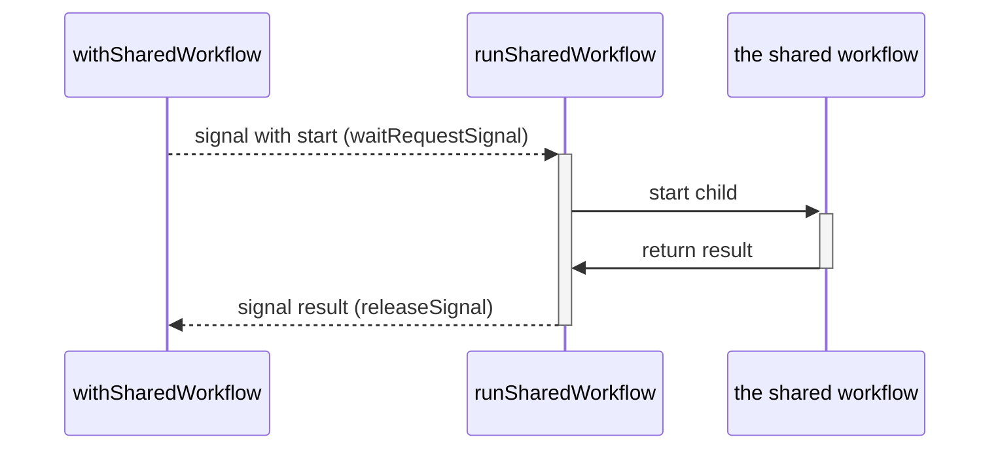
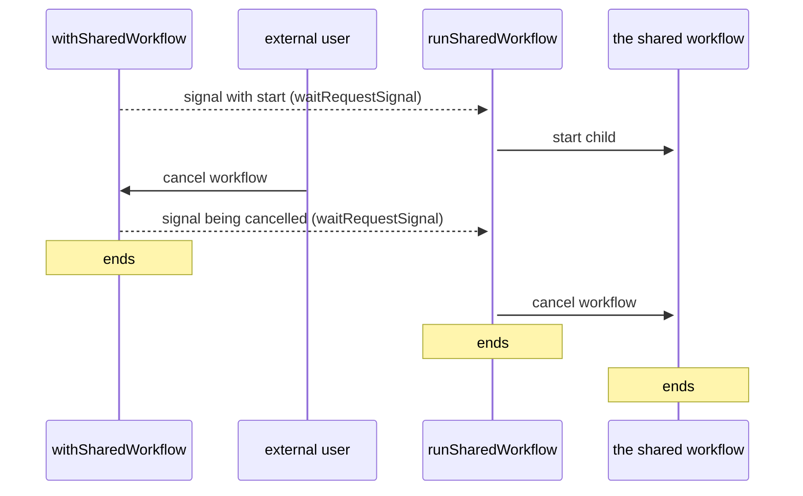
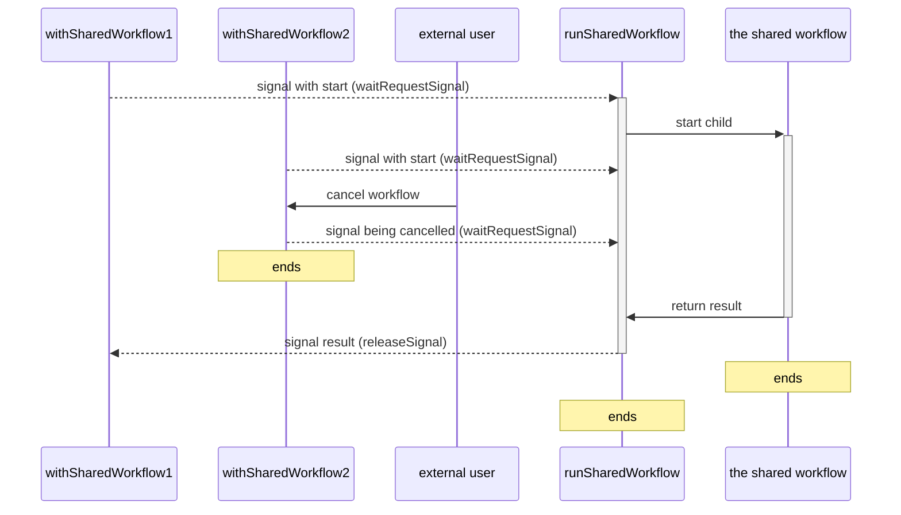

# Lifetime of a shared workflow

Scenario 1: one workflow calls withSharedWorkflow and waits for the result.

Scenario 2. One workflow calls withSharedWorkflow, waits for the result, but gets cancelled before it receives the result.

Scenario 3. Two workflows call withSharedWorkflow and wait for the result. One of them gets cancelled before it receives the result.

